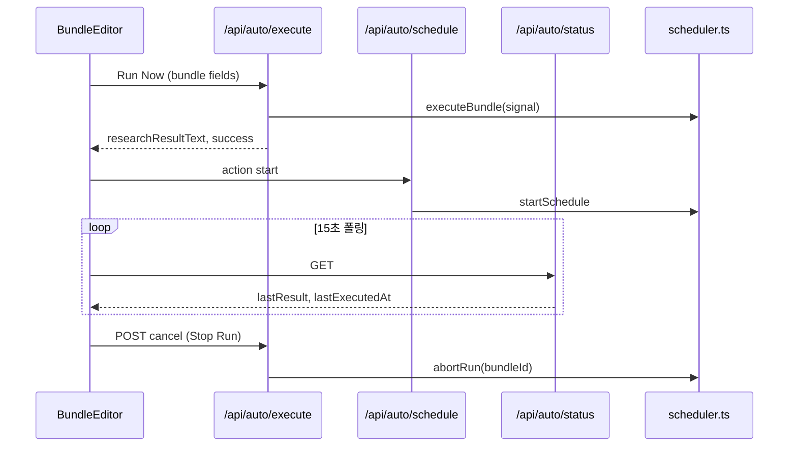

# Auto API

## 개요

Auto 모드는 실행·스케줄·상태 조회·메신저 연동을 위한 `/api/auto/*` REST API를 제공합니다.

## 목적

- 번들 즉시 실행 및 취소
- 서버 스케줄 시작·중지
- 스케줄 실행 결과 폴링
- 카카오 OAuth·텔레그램 테스트

## 주요 구성요소

| 엔드포인트 | 역할 | 경로 |
|-----------|------|------|
| POST /api/auto/execute | Run Now | `src/routes/api/auto/execute/+server.ts` |
| POST /api/auto/execute/cancel | Run Now 취소 | `src/routes/api/auto/execute/cancel/+server.ts` |
| POST /api/auto/schedule | 스케줄 start/stop | `src/routes/api/auto/schedule/+server.ts` |
| GET /api/auto/status | 스케줄 상태 | `src/routes/api/auto/status/+server.ts` |
| /api/auto/kakao/* | 카카오 OAuth·상태·테스트 | `src/routes/api/auto/kakao/` |
| /api/auto/telegram/* | 텔레그램 상태·테스트 | `src/routes/api/auto/telegram/` |

## 동작 흐름



## 사용 방법

### POST /api/auto/execute

**요청 본문**

| 필드 | 필수 | 설명 |
|------|------|------|
| `bundleId` | 권장 | 취소 API 연동용 |
| `title` | O | 번들 제목 |
| `autoApplyText` | O | 분석 프롬프트 |
| `autoReferUrl` | — | URL 배열 |
| `enableWebSearch` | — | 웹 검색 |
| `telegramEnabled` | — | 텔레그램 전송 |
| `telegramBotToken` | — | 봇 토큰 (클라이언트에서 resolve) |
| `telegramChatId` | — | 채팅 ID |
| `llmProvider` | — | `local` / `omniroute` |

**검증**: `title`·`autoApplyText` 필수, URL 1개 이상 또는 `enableWebSearch: true`

**응답 (200)**: `executeBundle()` 결과 — `researchResultText`, `success`, `kakaoSent`, `telegramSent` 등

### POST /api/auto/execute/cancel

**요청**: `{ "bundleId": "string" }`

**응답**: `{ "success": true }`

### POST /api/auto/schedule

**action: `start`** — 번들 필드 + 스케줄 설정 전달

| 추가 필드 | 설명 |
|----------|------|
| `id` | 번들 ID |
| `autoTimeSetting` | 분 단위 (minutes 모드) |
| `scheduleType` | `minutes` / `daily` / `days` |
| `scheduleTime` | `HH:mm` |
| `scheduleDays` | N일 (days 모드) |

**action: `stop`** — `{ "action": "stop", "id": "bundleId" }`

**action: `stop-all`** — 모든 스케줄 중지 (UI 미사용)

### GET /api/auto/status

**응답**: 활성 스케줄 번들만 포함

```json
{
  "<bundleId>": {
    "isActive": true,
    "isRunning": false,
    "lastResult": "string | null",
    "lastExecutedAt": "string | null"
  }
}
```

### 카카오 API

| 경로 | 메서드 | 설명 |
|------|--------|------|
| `/api/auto/kakao/connect` | GET | OAuth 리다이렉트 (`KAKAO_REST_API_KEY` 필요) |
| `/api/auto/kakao/callback` | GET | OAuth 콜백 → `/?mode=auto&kakao=connected\|error` |
| `/api/auto/kakao/status` | GET | `configured`, `connected`, `hasTokens`, `tokenExpired` |
| `/api/auto/kakao/test` | POST | 테스트 메모 전송 |

### 텔레그램 API

| 경로 | 메서드 | 설명 |
|------|--------|------|
| `/api/auto/telegram/status` | GET | `{ configured }` — `.env` `TELEGRAM_BOT_TOKEN` 여부 |
| `/api/auto/telegram/test` | POST | `{ chatId, botToken? }` 테스트 전송 |

## 관련 파일

- `src/routes/api/auto/execute/+server.ts`
- `src/routes/api/auto/execute/cancel/+server.ts`
- `src/routes/api/auto/schedule/+server.ts`
- `src/routes/api/auto/status/+server.ts`
- `src/routes/api/auto/kakao/` — connect, callback, status, test
- `src/routes/api/auto/telegram/` — status, test
- `src/lib/stores/auto.svelte.ts` — API 호출 클라이언트

## 참고

- `minutes` 스케줄 시작 시 `autoTimeSetting >= 1` 검증
- 카카오 OAuth 콜백 실패 시 `kakao=error&msg=...` 쿼리로 리다이렉트
- 텔레그램 테스트는 요청 본문의 `botToken`을 우선 사용 (없으면 `.env` 폴백)
