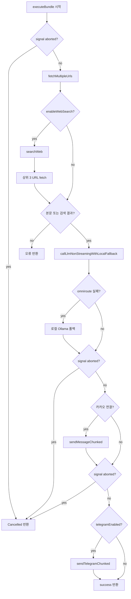

# Auto 실행 파이프라인

## 개요

Auto 번들 실행은 `executeBundle()` 함수(`src/lib/server/scheduler.ts`)에서 오케스트레이션됩니다. Run Now와 스케줄 실행 모두 동일 파이프라인을 사용하며, Run Now만 취소(Abort) 신호를 전달합니다.

## 목적

- URL·웹 검색·LLM·메신저 전송을 일관된 순서로 처리
- Run Now 중단 시 fetch 단계와 전송 전 단계에서 취소 반영
- OmniRoute 실패 시 로컬 Ollama로 자동 폴백

## 주요 구성요소

| 구성요소 | 역할 | 관련 경로 |
|---------|------|----------|
| executeBundle | 실행 파이프라인 본체 | `src/lib/server/scheduler.ts` |
| fetchMultipleUrls | 참조 URL 일괄 fetch | `src/lib/server/scraper.ts` |
| searchWeb | 웹 검색 (SearXNG→Serper→DDG) | `src/lib/server/search.ts` |
| callLlmNonStreamingWithLocalFallback | 비스트리밍 LLM + 로컬 폴백 | `src/lib/server/llm/index.ts` |
| sendMessageChunked (Kakao) | 카카오 메모 전송 | `src/lib/server/kakao.ts` |
| sendTelegramChunked | 텔레그램 메시지 전송 | `src/lib/server/telegram.ts` |
| runAbortControllers | Run Now 취소용 Map | `src/lib/server/scheduler.ts` |

## 동작 흐름

### 단계별 처리

1. **취소 확인** — `signal.aborted`이면 `{ success: false, error: 'Cancelled' }` 반환
2. **URL fetch** — `fetchMultipleUrls(autoReferUrl, signal)`: URL당 20초 타임아웃, 최대 80,000자
3. **웹 검색** (옵션) — 쿼리: `` `${autoApplyText} ${오늘 ISO 날짜}` ``, `formatSearchContext()`로 스니펫 생성
4. **검색 URL fetch** — 상위 3개 URL(참조 URL과 중복 제외), 본문 100자 초과만 유지
5. **검증** — URL 본문과 검색 컨텍스트가 모두 없으면 오류 반환
6. **프롬프트 구성** — 한국어 시스템 프롬프트 + 실행 일시·URL·검색 섹션
7. **LLM 호출** — `maxTokens: 8192`, `temperature: 0.1`, 타임아웃 10분
8. **취소 확인** (LLM 후)
9. **카카오 전송** — `isKakaoConnected()`이고 결과 텍스트가 있으면 1,000자 청크, 500ms 간격
10. **취소 확인** (텔레그램 전)
11. **텔레그램 전송** — `telegramEnabled && token && chatId && result`이면 4,000자 청크, 300ms 간격



### LLM 폴백

OmniRoute 호출이 실패하거나 빈 응답이면 로컬 Ollama로 재시도하고, 결과 앞에 `buildLlmFallbackNotice()` 안내 문구를 붙입니다.

### 취소 메커니즘 (Run Now만)

| 계층 | 동작 |
|------|------|
| 클라이언트 | `AbortController`로 fetch 중단 + `POST /api/auto/execute/cancel` |
| 서버 | `runAbortControllers` Map에 bundleId별 `AbortController` 등록 |
| 파이프라인 | `signal`을 URL fetch·웹 검색에 전달, LLM 전후·전송 전 abort 확인 |
| LLM | abort signal 미전달 — LLM 완료 후 또는 fetch 단계에서 취소 |

스케줄 실행은 `signal` 없이 호출되며 취소 API가 없습니다.

## 사용 방법

### 실행 결과 객체

```json
{
  "researchResultText": "string",
  "success": true,
  "error": "string (optional)",
  "kakaoSent": false,
  "kakaoError": "string (optional)",
  "telegramSent": false,
  "telegramError": "string (optional)"
}
```

### 결과 이력

- `resultHistory`: 최대 50건, `executedAt` + `result` 기준 중복 제거
- Run Now 취소 시: `{ result: 'Cancelled', success: false }` 기록

## 관련 파일

- `src/lib/server/scheduler.ts` — `executeBundle`, `runTask`, `startSchedule`, `stopSchedule`
- `src/lib/server/scraper.ts` — URL fetch·HTML 텍스트 추출
- `src/lib/server/search.ts` — 웹 검색
- `src/lib/server/llm/index.ts` — LLM 라우팅·폴백
- `src/lib/server/kakao.ts` — 카카오 OAuth·토큰(`.kakao-tokens.json`)·전송
- `src/lib/server/telegram.ts` — 텔레그램 Bot API
- `src/routes/api/auto/execute/+server.ts` — Run Now API
- `src/routes/api/auto/execute/cancel/+server.ts` — 취소 API

## 참고

- 카카오 토큰은 서버 파일 `.kakao-tokens.json`에 저장됩니다.
- `GET /api/auto/telegram/status`는 `.env`의 `TELEGRAM_BOT_TOKEN`만 확인하며, 번들별 토큰은 클라이언트에서 전달합니다.
- 번들 삭제 시 `forceStopOnServer()`로 서버 스케줄을 먼저 중지합니다.
