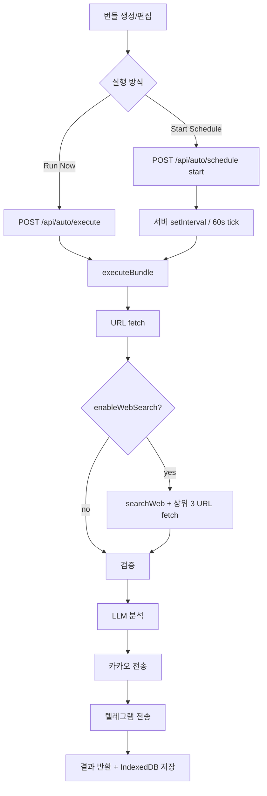

# Auto 모드

## 개요

Auto 모드는 **번들(Bundle)** 단위로 URL 분석·웹 검색·LLM 요약을 자동 실행하고, 선택적으로 카카오톡·텔레그램으로 결과를 전송하는 자동화 기능입니다. 즉시 실행(Run Now)과 서버 스케줄(분·일·N일)을 지원합니다.

## 목적

- 정기적으로 URL·웹 검색 기반 리서치를 자동화
- 분석 결과를 메신저로 배포
- 여러 번들을 독립적으로 관리·스케줄

## 주요 구성요소

| 구성요소 | 역할 | 관련 경로 |
|---------|------|----------|
| AutoLayout | 번들 목록, 카카오 연동 UI, 사이드바 | `src/lib/components/auto/AutoLayout.svelte` |
| BundleEditor | 번들 폼, Run Now, 스케줄 on/off | `src/lib/components/auto/BundleEditor.svelte` |
| TelegramSettingsModal | 텔레그램 봇·수신처 CRUD | `src/lib/components/auto/TelegramSettingsModal.svelte` |
| autoStore | 번들 CRUD, 실행·스케줄, 폴링 | `src/lib/stores/auto.svelte.ts` |
| scheduler | 스케줄 엔진, `executeBundle` | `src/lib/server/scheduler.ts` |
| telegramConfigsStore | 봇·채팅 설정 (클라이언트) | `src/lib/stores/telegramConfigs.svelte.ts` |

## 동작 흐름

1. 사용자가 번들을 생성·편집합니다 (제목, 프롬프트, URL, 웹 검색, 텔레그램, LLM 제공자, 스케줄).
2. **Run Now** 또는 **Start Schedule**로 서버에 실행을 요청합니다.
3. 서버가 URL fetch → (옵션) 웹 검색 → LLM 분석 → (옵션) 카카오·텔레그램 전송을 수행합니다.
4. 결과는 번들의 `researchResultText`와 `resultHistory`(최대 50건)에 저장됩니다.

## 사용 방법

### 번들 필드

| 필드 | 설명 |
|------|------|
| `title` | 고유 제목 (필수) |
| `autoApplyText` | LLM 분석 프롬프트 (필수) |
| `autoReferUrl` | 참조 URL 목록 |
| `enableWebSearch` | 웹 검색 on/off |
| `telegramEnabled` | 텔레그램 전송 on/off |
| `telegramBotId` / `telegramChatId` | 텔레그램 설정 모달에서 등록한 봇·수신처 ID |
| `llmProvider` | `local` 또는 `omniroute` |
| `scheduleType` | `minutes` / `daily` / `days` |

실행 조건: URL 1개 이상 **또는** `enableWebSearch: true` 중 하나는 반드시 필요합니다.

### 스케줄 유형

| 유형 | 설정 | 동작 |
|------|------|------|
| `minutes` | 30~1440분 슬라이더 | `setInterval`로 N분마다 실행. 시작 시 즉시 1회 실행(동시 LLM 2개 미만일 때) |
| `daily` | `HH:mm` | 매일 지정 시각, 60초 tick으로 확인 |
| `days` | 1~365일 + `HH:mm` | N일마다 지정 시각 |

### Run Now / Stop Run

- **Run Now**: 저장 없이 현재 폼 값으로 즉시 실행합니다.
- **Stop Run**: `POST /api/auto/execute/cancel` + 클라이언트 `AbortController`로 중단합니다.
- 실행·스케줄 활성 중에는 번들 설정이 잠깁니다 (`settingsLocked`).

### 메신저

- **카카오**: 전역 OAuth 연동. 연결되어 있으면 모든 성공 실행 결과가 카카오로 전송됩니다 (번들별 설정 없음).
- **텔레그램**: 번들별 on/off. 봇 토큰·채팅 ID는 클라이언트 IndexedDB에 저장됩니다.

## 관련 파일

- `src/lib/types/auto.ts` — `AutoBundle`, `ScheduleType` 타입
- `src/lib/stores/auto.svelte.ts` — 클라이언트 상태
- `src/lib/server/scheduler.ts` — 스케줄·실행 엔진
- `src/lib/components/auto/` — Auto UI 컴포넌트
- `src/routes/api/auto/` — Auto API 라우트

## 참고

- 스케줄 상태는 **서버 메모리**에만 존재합니다. 서버 재시작 후 `isActive`는 클라이언트에서 `false`로 초기화되며 스케줄을 다시 시작해야 합니다. 상세·복원 방안은 [scheduler-persistence.md](./scheduler-persistence.md)를 참고하세요.
- 스케줄 실행 결과는 클라이언트가 15초마다 `GET /api/auto/status`를 폴링해 반영합니다.
- 동시 LLM 실행은 서버에서 최대 2개(`MAX_CONCURRENT_LLM`)로 제한됩니다.
- 번들 저장 키: IndexedDB `jukimbot-auto-bundles`.
