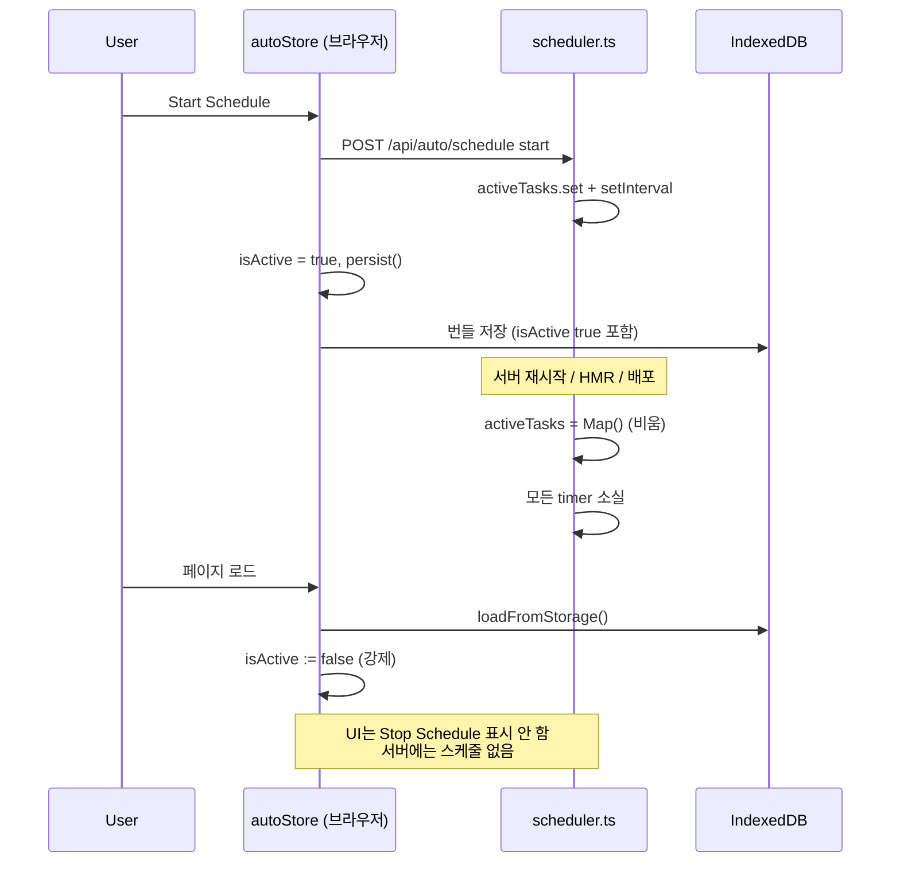
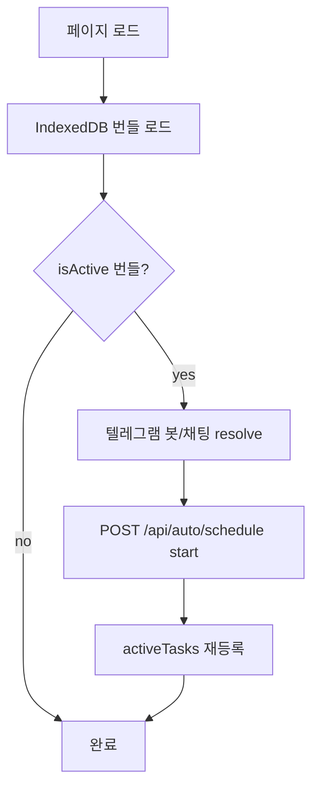

# 스케줄러 영속화

## 개요

Auto 스케줄은 서버 프로세스 메모리(`activeTasks` Map)에만 존재합니다. SvelteKit 개발 서버 재시작·배포·HMR로 `scheduler.ts` 모듈이 다시 로드되면 모든 타이머와 실행 상태가 사라지며, 클라이언트는 별도 복원 로직 없이 `isActive`를 `false`로 초기화합니다.

## 목적

- 현재 스케줄 저장·복원 동작과 한계를 명확히 기록
- 서버 재시작 후 발생하는 클라이언트-서버 상태 불일치를 설명
- 코드베이스 구조에 맞는 복원 방안을 **설계 참고**로 정리 (아래 방안은 모두 **미구현**)

## 주요 구성요소

| 구성요소 | 역할 | 관련 경로 |
|---------|------|----------|
| `activeTasks` | 실행 중 스케줄 Map (메모리 전용) | `src/lib/server/scheduler.ts` |
| `startSchedule` / `stopSchedule` | 스케줄 등록·해제 | `src/lib/server/scheduler.ts` |
| `getAllTaskStatuses` | 활성 스케줄 상태 조회 | `src/lib/server/scheduler.ts` |
| `POST /api/auto/schedule` | 클라이언트 → 서버 스케줄 제어 | `src/routes/api/auto/schedule/+server.ts` |
| `GET /api/auto/status` | 폴링용 상태 API | `src/routes/api/auto/status/+server.ts` |
| `autoStore` | 번들·`isActive` UI 상태 | `src/lib/stores/auto.svelte.ts` |
| IndexedDB `jukimbot-auto-bundles` | 번들 설정 영구 저장 (클라이언트) | `src/lib/stores/auto.svelte.ts` |

## 현재 구현 (메모리 전용)

### 서버 `ScheduledTask`

`startSchedule()` 호출 시 `activeTasks`에 등록되는 객체입니다.

| 필드 | 영속 가능 | 설명 |
|------|----------|------|
| `id`, `title`, `autoApplyText`, `autoReferUrl` | O | 번들 실행 설정 |
| `autoTimeSetting`, `scheduleType`, `scheduleTime`, `scheduleDays` | O | 스케줄 주기 |
| `enableWebSearch`, `telegramEnabled`, `llmProvider` | O | 실행 옵션 |
| `telegramBotToken`, `telegramChatId` | O | 스케줄 시작 시 클라이언트가 resolve한 값 |
| `timer` | X | `setInterval` 핸들 (런타임) |
| `nextRunAt` | △ | `daily`/`days` 모드 다음 실행 시각 (재계산 가능) |
| `lastResult`, `lastExecutedAt` | △ | 실행 이력 (복원 시 선택) |
| `isRunning`, `executionCount` | X | 런타임 상태 |

### 스케줄 유형별 타이머

| `scheduleType` | 서버 타이머 | 동작 |
|----------------|------------|------|
| `minutes` | 번들별 `setInterval` | N분마다 `runTask`, 시작 시 즉시 1회 실행(동시 LLM 2개 미만) |
| `daily` | 공유 60초 tick (`timeBasedTickTimer`) | `nextRunAt` 도달 시 실행 후 다음날 같은 시각 재설정 |
| `days` | 공유 60초 tick | `lastExecutedAt` + N일 후 같은 시각 재설정 |

모듈 로드 시 로그: `[Scheduler] Module loaded/reloaded - activeTasks is fresh (empty)`.

### 클라이언트 번들 저장

- 번들 설정은 IndexedDB 키 `jukimbot-auto-bundles`에 JSON으로 저장됩니다.
- `loadFromStorage()`는 **항상** `isActive: false`, `isExecuting: false`로 덮어씁니다 (`auto.svelte.ts` 478행). 저장된 JSON에 `isActive: true`가 있어도 로드 시 무시됩니다.
- `startBundle()` 성공 시 `isActive = true`로 `persist()`하지만, 페이지 새로고침·재방문 시 다시 `false`입니다.

## 서버 재시작 시 영향

| 항목 | 재시작 전 | 재시작 후 |
|------|----------|----------|
| 서버 `activeTasks` | 등록된 스케줄·타이머 | 빈 Map |
| 서버 `lastResult` / `lastExecutedAt` | 메모리에 보관 | 소실 |
| 클라이언트 `isActive` | `true` (실행 중 UI) | `false` (강제 초기화) |
| IndexedDB 번들 설정 | 유지 | 유지 |
| 카카오 토큰 (`.kakao-tokens.json`) | 유지 | 유지 (별도 파일) |
| 텔레그램 봇 토큰 | IndexedDB | 유지 |

### 폴링 동작

`autoStore`는 15초마다 `GET /api/auto/status`를 호출합니다. 재시작 후 서버에 활성 태스크가 없으면 빈 객체 `{}`가 반환되며, 클라이언트는 새 실행 결과를 받지 못합니다.

### 수동 복구 (현재 유일한 방법)

사용자가 Auto UI에서 해당 번들의 **Start Schedule**을 다시 눌러 `POST /api/auto/schedule` `action: start`를 호출해야 합니다. 브라우저 탭이 열려 있지 않으면 스케줄은 복구되지 않습니다.

## 클라이언트-서버 상태 불일치

재시작 직후 페이지를 새로고침하지 않은 경우:

- UI에 `isActive: true`(녹색 표시)가 남아 있을 수 있으나 서버에는 스케줄이 없습니다.
- `GET /api/auto/status`는 해당 `bundleId`를 반환하지 않아 폴링으로 결과가 갱신되지 않습니다.
- **Stop Schedule**을 누르면 `stopSchedule(id)`가 no-op(이미 없음)이고, 클라이언트만 `isActive: false`로 정리됩니다.

번들 삭제 시 `forceStopOnServer()`가 `action: stop`을 호출해 서버 스케줄을 먼저 중지합니다.

## 복원 방안 (미구현)

아래는 현재 코드에 **구현되어 있지 않은** 설계 옵션입니다. 구현 시 보안·운영 요구사항에 맞게 선택합니다.

### 방안 A: 클라이언트 재등록 (권장 — 변경 범위 작음)

**개요**: IndexedDB에 스케줄 활성 플래그를 유지하고, 앱 로드 시 서버에 `start`를 다시 보냅니다.

| 단계 | 내용 |
|------|------|
| 1 | `loadFromStorage()`에서 저장된 `isActive`를 복원 (또는 `scheduleEnabled` 필드 분리) |
| 2 | `constructor` 또는 `onMount` 후 `bundles.filter(b => b.isActive)`에 대해 `startBundle(id)` 호출 |
| 3 | `telegramConfigsStore`에서 봇·채팅 resolve 후 기존과 동일한 `POST /api/auto/schedule` 본문 전송 |

**장점**: 서버 파일·DB 불필요, 기존 API 재사용  
**단점**: 브라우저가 한 번은 열려 있어야 함 (완전 무인 서버 스케줄 아님)  
**주의**: 텔레그램 토큰은 클라이언트 IndexedDB에만 있으므로 서버 단독 복원 불가

### 방안 B: 서버 파일 영속화 (카카오 토큰 패턴)

**개요**: `.kakao-tokens.json`과 유사하게 `.jukimbot-schedules.json`에 직렬화 가능한 스케줄 목록을 저장합니다.

| 단계 | 내용 |
|------|------|
| 1 | `startSchedule` / `stopSchedule` 시 파일 동기화 (`timer`·`isRunning` 제외) |
| 2 | SvelteKit `hooks.server.ts` 또는 모듈 init에서 파일 로드 후 `startSchedule` 재호출 |
| 3 | `.gitignore`에 스케줄 파일 추가 (텔레그램 토큰 포함 가능) |

**장점**: 브라우저 없이 서버 재시작 후에도 스케줄 자동 재개  
**단점**: 텔레그램 토큰이 서버 디스크에 평문 저장; 다중 인스턴스·수평 확장 시 파일 경합  
**참고**: `src/lib/server/kakao.ts`의 `loadTokens` / `saveTokens` 패턴 재사용 가능

### 방안 C: 하이브리드 (서버 스냅샷 + 클라이언트 보조)

**개요**: 서버는 스케줄 메타데이터만 파일에 저장하고, 텔레그램 토큰 없는 번들만 서버 단독 복원. 토큰 필요 번들은 클라이언트 접속 시 방안 A로 보완.

**장점**: 민감 정보 최소화 + 부분 무인 복원  
**단점**: 두 경로 유지·동기화 복잡도 증가

### 방안 D: 외부 스케줄러 (아키텍처 변경)

cron·systemd·클라우드 스케줄러가 `POST /api/auto/execute`를 주기 호출합니다. 서버 `setInterval` 스케줄러를 사용하지 않습니다.

**장점**: 프로세스 재시작과 무관, 운영 도구 표준화  
**단점**: Auto UI 스케줄 on/off와 별도 운영; 현재 `schedule` API·`activeTasks` 설계와 이중화

## 구현 시 체크리스트

| 항목 | 설명 |
|------|------|
| `nextRunAt` 재계산 | `daily`/`days` 복원 시 `getNextRunDaily` / `getNextRunDays`로 누락 실행 여부 결정 |
| 동시 실행 제한 | `MAX_CONCURRENT_LLM = 2` — 복원 직후 다수 immediate 실행 시 지연 로직 유지 |
| HMR | 개발 중 `scheduler.ts` 수정만으로도 스케줄 소실 — 방안 A/B 모두 고려 |
| `stop-all` | `POST /api/auto/schedule` `action: stop-all`은 UI 미사용; 영속화 시 파일도 비워야 함 |
| 보안 | 서버 파일에 `telegramBotToken` 저장 시 `.gitignore`·파일 권한 필수 |

## 사용 방법

### 운영자 (현재)

1. 서버 재시작·배포 후 Auto 화면을 엽니다.
2. 스케줄이 필요한 번들마다 **Start Schedule**을 다시 누릅니다.
3. 카카오 연동은 `.kakao-tokens.json`이 유지되면 재연동 없이 전송 가능합니다.

### 개발자 (복원 구현 시)

- 최소 변경: **방안 A** — `auto.svelte.ts`의 `loadFromStorage` + 초기화 후 `startBundle` 루프
- 무인 서버: **방안 B** — `hooks.server.ts` 추가 + `scheduler.ts`에 파일 I/O

## 관련 파일

- `src/lib/server/scheduler.ts` — `activeTasks`, `startSchedule`, `stopSchedule`, `getAllTaskStatuses`
- `src/routes/api/auto/schedule/+server.ts` — 스케줄 start/stop API
- `src/routes/api/auto/status/+server.ts` — 상태 폴링 API
- `src/lib/stores/auto.svelte.ts` — `isActive` 초기화·`startBundle`·폴링
- `src/lib/types/auto.ts` — `AutoBundle`, `BundleStatus`
- `docs/storage/server-file-storage.md` — 서버 파일 저장 (카카오 토큰) 패턴
- `docs/auto/overview.md` — Auto 스케줄 유형 개요

## 참고

- SvelteKit `hooks.server.ts`는 현재 프로젝트에 **없습니다**. 서버 기동 시 복원 로직을 넣으려면 신규 추가가 필요합니다.
- `isActive`는 클라이언트 UI 전용에 가깝고 서버 `getTaskStatus().isActive`는 항상 `true`(Map에 존재할 때)입니다.
- 스케줄 실행은 Run Now와 달리 `AbortSignal`·취소 API를 지원하지 않습니다 (`docs/auto/execution-pipeline.md`).
