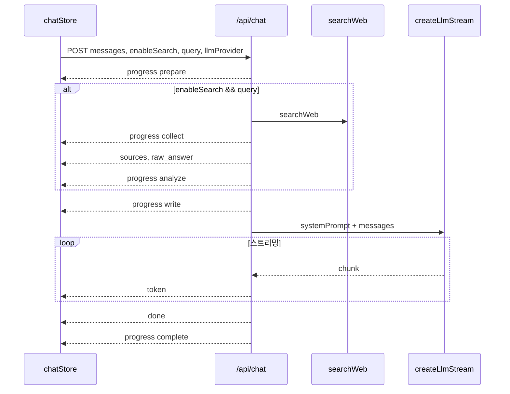

# Chat API

## 개요

Chat 모드의 서버 API는 `POST /api/chat` 단일 엔드포인트로 SSE(Server-Sent Events) 스트리밍 응답을 반환합니다.

## 목적

- 클라이언트와 LLM 사이의 스트리밍 중계
- 웹 검색·페이지 수집 결과를 SSE 이벤트로 전달
- 진행 단계(progress)를 실시간 UI에 반영

## 주요 구성요소

| 구성요소 | 역할 | 관련 경로 |
|---------|------|----------|
| POST /api/chat | 채팅 SSE 스트림 | `src/routes/api/chat/+server.ts` |
| streamChat | 클라이언트 fetch·SSE 파싱 | `src/lib/services/api.ts` |
| pipeLlmChatStream | LLM 스트림 → token 이벤트 변환 | `src/lib/server/llm/streamParsers.ts` |
| GET /api/llm/health | LLM 제공자 연결 확인 | `src/routes/api/llm/health/+server.ts` |

## 동작 흐름

## 사용 방법

### POST /api/chat

**요청 본문 (JSON)**

| 필드 | 타입 | 설명 |
|------|------|------|
| `messages` | `{ role, content }[]` | 대화 이력 (`user` / `assistant`) |
| `enableSearch` | `boolean` | 웹 검색 활성화 |
| `query` | `string` | 검색 쿼리 (보통 최신 사용자 메시지) |
| `currentDate` | `string` | 날짜 컨텍스트 |
| `localeCalendarDate` | `string` | `YYYY-MM-DD` 클라이언트 달력 날짜 |
| `llmProvider` | `'local' \| 'omniroute'` | LLM 제공자 |

**응답**: `Content-Type: text/event-stream`, 각 이벤트는 `data: {JSON}\n\n` 형식

### SSE 이벤트 타입

| type | 주요 필드 | 설명 |
|------|----------|------|
| `progress` | `phase`, `label`, `detail?` | 파이프라인 진행 (`prepare` / `collect` / `analyze` / `write` / `complete`) |
| `sources` | `data: SearchResult[]` | 검색 결과 (`title`, `url`, `snippet`) |
| `raw_answer` | `content` | 검색 기반 원문 마크다운 (AI 요약 전) |
| `token` | `content` | LLM 스트림 청크 |
| `done` | — | 스트림 종료 |
| `error` | `message` | 연결·타임아웃 오류 |

### progress 단계 (서버)

| phase | label (예시) | 조건 |
|-------|-------------|------|
| `prepare` | 질문 분석 중 | 항상 |
| `collect` | 웹 검색 중 / 완료, 페이지 읽는 중 | `enableSearch && query` |
| `analyze` | 출처 정리 중 | 검색 수행 후 |
| `write` | 답변 작성 중 | LLM 호출 전 |
| `complete` | 완료 | LLM 스트림 종료 후 |

### GET /api/llm/health

**쿼리**: `provider=local|omniroute`

**응답**: `{ ok: boolean }`

## 관련 파일

- `src/routes/api/chat/+server.ts` — API 핸들러
- `src/lib/services/api.ts` — `streamChat` 클라이언트
- `src/lib/server/llm/index.ts` — `createLlmStream`, `pipeLlmChatStream`
- `src/lib/server/llm/ollamaProvider.ts` — Ollama (`OLLAMA_URL`, `OLLAMA_MODEL`)
- `src/lib/server/llm/omnirouteProvider.ts` — OmniRoute (`OMNIROUTE_BASE_URL`, `OMNIROUTE_MODEL`)
- `src/routes/api/llm/health/+server.ts` — 헬스체크

## 참고

- 클라이언트 `AbortController`로 중단 시 `AbortError`가 발생하며 `onDone()`으로 처리됩니다.
- 비정상 HTTP 응답 시 `Server error: {status} {statusText}` 메시지가 표시됩니다.
- Ollama 기본 URL: `http://localhost:11434`, 기본 모델: `llama3.1:8b`.
- OmniRoute 기본 URL: `http://localhost:20128/v1`, 인증: `OMNIROUTE_API_KEY` 또는 `LLM_API_KEY`.
