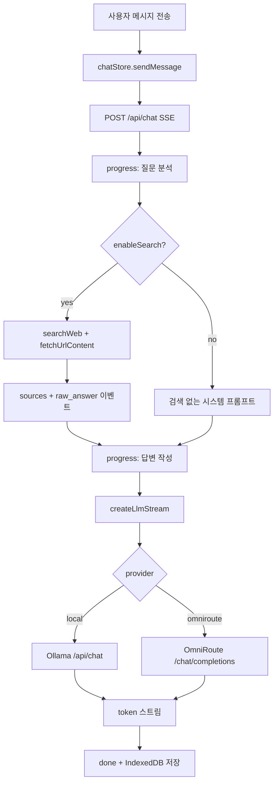

# Chat 모드

## 개요

Chat 모드는 JukimBot 앱의 기본 대화 화면으로, 로컬 Ollama 또는 OmniRoute(OpenRouter) LLM과 스트리밍 채팅을 제공합니다. 선택적으로 웹 검색을 켜면 검색 결과와 페이지 본문을 수집한 뒤 LLM이 근거 기반 답변을 생성합니다.

## 목적

- 로컬·클라우드 LLM을 전환하며 대화형 질의응답 제공
- 웹 검색·페이지 스크래핑으로 최신 정보 기반 답변 지원
- 대화 이력을 브라우저 IndexedDB에 저장해 세션 간 유지

## 주요 구성요소

| 구성요소 | 역할 | 관련 경로 |
|---------|------|----------|
| ChatLayout | 사이드바·헤더·메시지 목록·입력창 레이아웃 | `src/lib/components/ChatLayout.svelte` |
| ChatInput | 메시지 입력, Web 검색 토글, 생성 중단 | `src/lib/components/ChatInput.svelte` |
| MessageBubble | 사용자·어시스턴트 버블, 소스 카드, 원문 답변 | `src/lib/components/MessageBubble.svelte` |
| ChatProgressStepper | 5단계 진행 표시 (준비→수집→분석→작성→완료) | `src/lib/components/ChatProgressStepper.svelte` |
| chatStore | 대화 CRUD, 전송, 스트리밍 상태, IndexedDB 영속 | `src/lib/stores/chat.svelte.ts` |
| llmStore | LLM 제공자 선택 (`local` / `omniroute`) | `src/lib/stores/llm.svelte.ts` |
| chat API | SSE 스트리밍, 검색·LLM 파이프라인 | `src/routes/api/chat/+server.ts` |
| LLM 라우터 | Ollama·OmniRoute 스트림 생성 | `src/lib/server/llm/index.ts` |

## 동작 흐름

1. 사용자가 `ChatInput`에서 메시지를 전송합니다.
2. `chatStore.sendMessage()`가 사용자 메시지와 스트리밍 중인 어시스턴트 메시지를 추가합니다.
3. 최근 완료된 메시지 최대 20개를 `POST /api/chat`에 전달합니다.
4. 서버가 진행 단계(`progress`)를 SSE로 전송하며, 웹 검색이 켜져 있으면 검색·페이지 수집을 수행합니다.
5. LLM 스트림 토큰(`token`)이 클라이언트에 전달되고, 완료 시 `done` 이벤트 후 IndexedDB에 저장합니다.

## 사용 방법

### 대화 관리

- **New Chat**: 새 대화 생성. 첫 메시지 전송 시 제목이 메시지 앞 50자로 자동 설정됩니다.
- **대화 선택·삭제**: 사이드바에서 선택하거나 삭제합니다.
- **메시지 초기화**: 헤더 휴지통 아이콘으로 현재 대화 메시지만 비웁니다.

### 웹 검색

- 입력창 **Web** 토글로 활성화합니다 (기본값: 켜짐).
- 검색 쿼리는 사용자 메시지에 클라이언트 달력 날짜(`localeCalendarDate`)가 붙습니다.
- 검색 제공자 우선순위: SearXNG → Serper → DuckDuckGo.

### LLM 제공자

- 사이드바에서 **Local** (`llama3.1:8b`, Ollama) 또는 **OpenRouter** (`omniroute`)를 선택합니다.
- 선택값은 `localStorage` 키 `jukimbot-llm-provider`에 저장됩니다.
- 앱 마운트 시 `GET /api/llm/health?provider=...`로 연결 상태를 확인합니다.

### 답변 깊이

질문 길이·키워드에 따라 `brief` / `standard` / `comprehensive` 깊이가 자동 결정되며, 수집 URL 수·페이지 문자 수·`num_predict`가 달라집니다 (`src/lib/server/answerDepth.ts`).

| 깊이 | URL 수 | 페이지당 최대 문자 |
|------|--------|-------------------|
| brief | 3 | 5,000 |
| standard | 5 | 8,000 |
| comprehensive | 8 | 12,000 |

## 관련 파일

- `src/routes/api/chat/+server.ts` — Chat API 핸들러
- `src/lib/stores/chat.svelte.ts` — 클라이언트 상태·전송 로직
- `src/lib/services/api.ts` — `streamChat` SSE 파서
- `src/lib/chatPipeline.ts` — 진행 단계 라벨 정의
- `src/lib/server/chatProgress.ts` — 서버 progress 이벤트 헬퍼
- `src/lib/server/llm/` — Ollama·OmniRoute 제공자
- `src/lib/server/search.ts` — 웹 검색
- `src/lib/server/scraper.ts` — URL 본문 추출
- `src/lib/types/index.ts` — `Message`, `Conversation` 타입

## 참고

- Chat 모드는 Deep Research(`/api/deep-search`)와 별도 경로입니다. Deep 모드는 이 문서 범위 밖입니다.
- Chat API는 OmniRoute 실패 시 자동 로컬 폴백을 하지 않습니다 (Auto 실행과 다름).
- 대화 데이터 키: IndexedDB `jukimbot-chat-conversations` (`jukimbot-db` / store `kv`).
