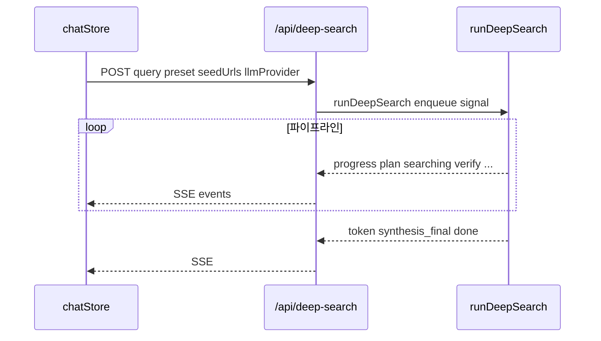

# Deep Research API

## 개요

Deep Research는 `POST /api/deep-search` 단일 엔드포인트로 SSE 스트리밍 응답을 반환합니다. 파이프라인 각 단계의 진행·중간 결과·최종 답변이 이벤트로 전달됩니다.

## 목적

- 다단계 리서치 진행 상황을 실시간 UI에 반영
- 수집 출처·검증 결과·합성 답변을 단계별로 전달
- 클라이언트 `streamDeepSearch()`와 서버 `runDeepSearch()` 연결

## 주요 구성요소

| 구성요소 | 역할 | 관련 경로 |
|---------|------|----------|
| POST /api/deep-search | SSE 핸들러 | `src/routes/api/deep-search/+server.ts` |
| streamDeepSearch | 클라이언트 fetch·파싱 | `src/lib/services/api.ts` |
| runDeepSearch | 서버 파이프라인 | `src/lib/server/deepSearch/index.ts` |

## 동작 흐름

## 사용 방법

### POST /api/deep-search

**요청 본문 (JSON)**

| 필드 | 타입 | 설명 |
|------|------|------|
| `messages` | `{ role, content }[]` | 대화 이력 (클라이언트: 최근 완료 20개) |
| `query` | `string` | 사용자 질문 |
| `currentDate` | `string` | 날짜 컨텍스트 |
| `localeCalendarDate` | `string` | `YYYY-MM-DD` |
| `seedUrls` | `string[]` | 첨부 시드 URL |
| `preset` | `'fast' \| 'balanced' \| 'deep'` | 미지정 시 `balanced` |
| `llmProvider` | `'local' \| 'omniroute'` | LLM 제공자 |

**응답**: `Content-Type: text/event-stream`

### SSE 이벤트 타입

| type | 주요 필드 | 설명 |
|------|----------|------|
| `progress` | `phase`, `label`, `detail?` | Chat과 동일 5단계 진행 |
| `start` | `preset`, `refineRounds`, `answerDepth` | 파이프라인 시작 |
| `evidence_warning` | `message` | 근거 없음 경고 |
| `plan` | `subQueries`, `strategy`, `subQuestions`, `stopCriteria` | 쿼리 계획 |
| `searching` | `query` | 웹 검색 중 |
| `sources` | `results`, `query`, `isUserProvided?` | 검색·시드 결과 |
| `raw_answer` | `content` | 수집 출처 마크다운 |
| `draft` | `content` | 초안 미리보기 (500자) |
| `refine_start` | `round`, `maxRounds` | 검증 라운드 시작 |
| `decompose` | `subQuestions`, `claims` | 주장 분해 |
| `verify` | `results`, `confidence` | 주장 검증 결과 |
| `web_search` | `round`, `queries`, `pagesFetched`, `reason` | gap-fill 검색 |
| `refine` | `thought`, `revisedDraft`, `confidence` | 초안 수정 |
| `complete` | `stopReason`, `confidence`, `totalPagesFetched` | 루프 종료 |
| `synthesis_start` | — | 최종 합성 시작 |
| `token` | `content` | 합성 스트림 청크 |
| `synthesis_final` | `content` | 인용 정리 후 최종 본문 |
| `done` | — | 스트림 종료 |
| `error` | `message` | 오류 |
| `keepalive` | — | 20초 간격 (클라이언트 무시) |

### 클라이언트 처리 (`chatStore.sendDeepSearch`)

- `onStep` → `deepSearchSteps[]` 누적, `DeepSearchProgress`에 표시
- `onSources` → `searchResults` 병합
- `onRawAnswer` → `rawAnswer`
- `onToken` / `onSynthesisFinal` → `content` (final은 교체)
- `onDone` → `isStreaming = false`, IndexedDB persist
- `AbortError` → `onDone()` (오류 아님)

## 관련 파일

- `src/routes/api/deep-search/+server.ts`
- `src/lib/services/api.ts` — `streamDeepSearch`
- `src/lib/stores/chat.svelte.ts` — `sendDeepSearch`
- `src/lib/types/index.ts` — `DeepSearchStep`, `DeepSearchEvent`, `ClaimVerification`
- `src/lib/components/DeepSearchProgress.svelte`

## 참고

- Chat API(`/api/chat`)와 별도 경로이며, Deep 활성 시 `sendDeepSearch`만 호출됩니다.
- `start` 이벤트의 `answerDepth`는 서버에서 emit되나 클라이언트 `onStep`에는 전달되지 않습니다.
- LLM 연결 실패 시 provider 폴백 없이 `error` 이벤트가 반환됩니다.
