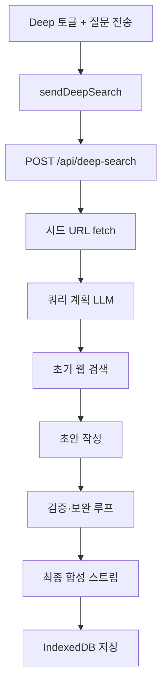

# Deep Research

## 개요

Deep Research는 Chat 모드에서 **Deep** 토글로 활성화하는 다단계 웹 리서치 기능입니다. 시드 URL 수집, 쿼리 계획, 웹 검색, 초안 작성, 주장 검증·보완 검색, 최종 합성까지 자동으로 수행합니다.

## 목적

- 단순 웹 검색 채팅보다 깊은 사실 검증·다중 라운드 리서치 제공
- 사용자가 첨부한 시드 URL을 우선 근거로 활용
- 검증 라운드·URL 예산을 프리셋으로 조절해 속도와 깊이 균형

## 주요 구성요소

| 구성요소 | 역할 | 관련 경로 |
|---------|------|----------|
| ChatInput | Deep 토글, 프리셋 선택, 시드 URL 입력 | `src/lib/components/ChatInput.svelte` |
| chatStore | `sendDeepSearch()`, 시드 URL 상태 | `src/lib/stores/chat.svelte.ts` |
| DeepSearchProgress | 단계별 타임라인 UI | `src/lib/components/DeepSearchProgress.svelte` |
| runDeepSearch | 파이프라인 오케스트레이터 | `src/lib/server/deepSearch/index.ts` |
| deepSearchBudget | 프리셋별 URL·라운드 예산 | `src/lib/deepSearchBudget.ts` |
| deep-search API | SSE 스트림 엔드포인트 | `src/routes/api/deep-search/+server.ts` |

## 동작 흐름

1. 사용자가 **Deep** 토글을 켜고 (선택) 시드 URL·프리셋을 설정한 뒤 질문을 전송합니다.
2. `POST /api/deep-search`가 SSE로 진행 이벤트를 스트리밍합니다.
3. 서버가 시드 URL fetch → 쿼리 계획 → 초기 웹 검색 → 초안 → 검증·보완 루프 → 최종 합성을 수행합니다.
4. 클라이언트는 `DeepSearchProgress`, `RawAnswerBlock`, 소스 카드, 최종 마크다운 답변을 표시합니다.

## 사용 방법

### UI 조작

- **Deep 토글**: Web 검색과 상호 배타적 (Deep on → Web off).
- **프리셋**: `fast`(1라운드) / `balanced`(2, 기본) / `deep`(4).
- **시드 URL**: 최대 8개 입력 (클라이언트). 서버는 정규화 후 최대 5개 fetch.
- **중단**: 일반 채팅과 동일하게 Stop 버튼 (`AbortController`).

### 프리셋 예산

| 프리셋 | 검증 라운드 | 초기 subQuery | gap 검색/라운드 | URL/쿼리 | 총 URL 상한 |
|--------|------------|---------------|-----------------|----------|------------|
| fast | 1 | 1 | 1 | 2 | 8 |
| balanced | 2 | 2 | 2 | 3 | 15 |
| deep | 4 | 3 | 3 | 3 | 25 |

### 답변 깊이

질문 휴리스틱(`answerDepth.ts`)으로 `brief` / `standard` / `comprehensive`가 결정됩니다. 프리셋과 교차 적용됩니다.

- `fast` 프리셋: 최대 `standard`
- `deep` 프리셋: 최소 `standard`
- `brief` 깊이: 초안을 그대로 스트리밍 (다단계 합성 생략)
- `standard`/`comprehensive`: `synthesizeAnswer` 하이브리드 합성

### 근거 없음 경고

수집된 페이지가 없으면 `evidence_warning` 이벤트와 함께 한국어 주의 배너가 표시됩니다. 답변은 LLM 추론이며 사실 확인되지 않았음을 안내합니다.

## 관련 파일

- `src/lib/server/deepSearch/index.ts` — 파이프라인 오케스트레이터
- `src/lib/deepSearchBudget.ts` — 프리셋·예산
- `src/lib/server/deepSearch/researchExecutor.ts` — 웹 검색·URL fetch
- `src/lib/server/deepSearch/queryPlanner.ts` — 쿼리 계획
- `src/lib/server/deepSearch/answerDrafter.ts` — 초안
- `src/lib/server/deepSearch/claimVerifier.ts` — 주장 검증
- `src/lib/server/deepSearch/gapSearchPlanner.ts` — 보완 검색 쿼리
- `src/lib/server/deepSearch/answerRefiner.ts` — 초안 수정
- `src/lib/server/deepSearch/answerSynthesizer.ts` — 최종 합성
- `src/lib/server/deepSearch/citationSanitizer.ts` — 인용·참고 자료 정리
- `src/routes/api/deep-search/+server.ts` — API 핸들러

## 참고

- LLM 제공자는 Chat 사이드바 선택값(`llmStore.provider`)을 사용하며, Auto와 달리 로컬 폴백 없음.
- `deepSearchPreset`, `deepSearchEnabled`, 시드 URL 큐는 **세션 상태**이며 페이지 새로고침 시 초기화됩니다.
- 완료된 메시지(`deepSearchSteps`, `rawAnswer`, `searchResults` 등)는 IndexedDB `jukimbot-chat-conversations`에 저장됩니다.
- `iterationEvaluator.ts`는 테스트용으로 존재하나 현재 파이프라인에 연결되어 있지 않습니다.
