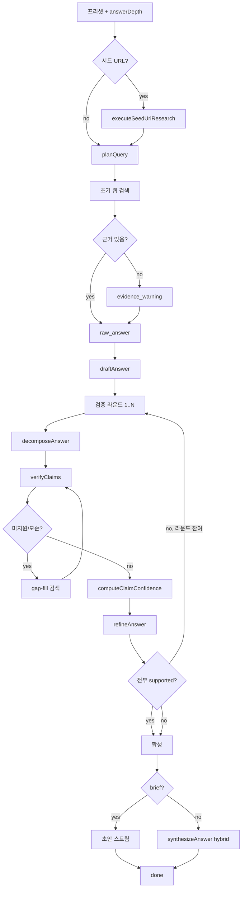

# Deep Research 파이프라인

## 개요

Deep Research 서버 파이프라인은 `runDeepSearch()` → `runDeepSearchImpl()` (`src/lib/server/deepSearch/index.ts`)에서 실행됩니다. 각 단계는 SSE 이벤트를 emit하며, URL·라운드 예산은 프리셋(`deepSearchBudget.ts`)으로 제한됩니다.

## 목적

- 리서치 단계를 모듈별로 분리해 계획·수집·검증·합성을 체계화
- 근거 부족 시 gap-fill 검색으로 주장을 재검증
- 수집 URL만 인용 허용(`citationSanitizer`)으로 환각 링크 방지

## 주요 구성요소

| 단계 | 모듈 | 역할 |
|------|------|------|
| 시드 수집 | `researchExecutor.ts` | 사용자 URL 병렬 fetch |
| 쿼리 계획 | `queryPlanner.ts` | subQuery·전략·subQuestion LLM 계획 |
| 웹 검색 | `researchExecutor.ts` | searchWeb + 페이지 fetch, URL 중복 제거 |
| 초안 | `answerDrafter.ts` | 근거 기반 또는 학습 지식 초안 |
| 분해 | `answerDecomposer.ts` | subQuestion + atomic claim 추출 |
| 검증 | `claimVerifier.ts` | supported/unsupported/contradicted/unverifiable |
| gap 검색 | `gapSearchPlanner.ts` | 규칙 기반 보완 쿼리 (LLM 없음) |
| 수정 | `answerRefiner.ts` | 검증 결과 반영 초안 개선 |
| 합성 | `answerSynthesizer.ts` | 최종 보고서 스트리밍 |
| 청크 분석 | `chunkPipeline.ts` | hybrid 합성 시 청크별 분석 |

## 동작 흐름

### 1. 초기화

- 프리셋 예산 resolve (`resolveDeepSearchPreset`, 기본 `balanced`)
- `answerDepth` 결정 (`resolveAnswerDepth` + 프리셋 floor/ceiling)
- 대화 컨텍스트: 메시지 2개 초과 시 최근 4개, 각 200자
- `progress: prepare`, `start` 이벤트 emit

### 2. Phase 0 — 시드 URL

- `executeSeedUrlResearch()`: 정규화 URL 최대 5개, 본문 80자 이상만 유지
- `sources` 이벤트 (`isUserProvided: true`)
- 리서치 컨텍스트에 **PRIORITY** 표시

### 3. Phase 0.5 — 쿼리 계획

- `planQuery()`: LLM JSON — 2~4 `subQueries`, `strategy`, 3~6 `subQuestions`, 3~5 `stopCriteria`
- 시드 본문 미리보기(3000자) 첨부
- 실패 시 사용자 질문 단일 쿼리로 폴백
- `plan` 이벤트 emit
- `stopCriteria`·`subQuestions`는 emit만 하고 루프 조건에는 미사용

### 4. Phase 0.6 — 초기 웹 검색

- 계획의 첫 `initialSubQueries`개 subQuery 실행
- 쿼리마다: `searchWeb` → `seenUrls` dedupe → `fetchUrlContent` (100자 초과만)
- 달력 날짜를 쿼리에 포함 (`resolveSearchCalendarDate`)
- `maxTotalUrls`, `urlsPerQuery`, `depthConfig.maxPageChars` 준수
- `searching`, `sources` 이벤트

### 5. 근거 확인·원문

- 페이지 없으면 `evidence_warning`
- `buildCollectedTextsMarkdown()` → `raw_answer` 이벤트

### 6. Phase 1 — 초안

- `draftAnswer()`: 근거 있으면 출처 기반, 없으면 학습 지식 전용 프롬프트
- `draft` 이벤트 (500자 미리보기)

### 7. Phase 2~N — 검증·보완 루프 (`refineRounds`회)

각 라운드:

1. `decomposeAnswer()` → subQuestion + claim (검증 배치 최대 12개)
2. `verifyClaims()` → 상태 분류
3. `applyEvidenceContextCheck()` — supported는 출처 본문에 substring 존재 필요
4. **gap-fill** (unsupported/contradicted + URL 예산 잔여):
   - `buildGapSearchQueries()` — 최대 2 claim → `maxGapSearches` 쿼리
   - `runWebSearchRound()` → 재검증
   - `web_search` (`reason: 'gap_fill'`), `raw_answer` 갱신
5. `computeClaimConfidence()` — supported 비율, contradicted 시 절반, 근거 없으면 0.5 상한
6. `refineAnswer()` → `{ thought, revisedDraft }`
7. **조기 종료**: 모든 claim `supported` + `hasEvidence`
8. `refine_start`, `decompose`, `verify`, `refine` 이벤트

### 8. 합성

- `complete` (stopReason, confidence, totalPagesFetched)
- `progress: write`, `synthesis_start`

**brief 깊이:**

- 경고 배너 + `currentDraft` → `finalizeDeepSearchSynthesis()` → 24자 청크 `token` 스트림 → `done`

**standard/comprehensive:**

- `synthesizeAnswer()` (`synthesisMode: 'hybrid'`)
- 멀티섹션: outline JSON → 섹션별 스트리밍 (`streamKind: 'section'`)
- outline 실패 시 single-pass 폴백
- `chunkPipeline` 선택적 사용
- `finalizeDeepSearchSynthesis()` — `## 참고 자료` append
- `token` 스트림, `synthesis_final`, `done`

## 사용 방법

개발자가 파이프라인을 확장할 때 참고할 제약:

| 제약 | 값 |
|------|-----|
| 클라이언트 시드 URL 상한 | 8 |
| 서버 시드 fetch 상한 | 5 (`MAX_SEED_URLS`) |
| claim 검증 배치 | 최대 12 |
| gap 쿼리 입력 claim | 최대 2 |
| keepalive 간격 | 20초 |
| 토큰 청크 (brief 스트림) | 24자 |

## 관련 파일

- `src/lib/server/deepSearch/index.ts` — 오케스트레이터
- `src/lib/server/deepSearch/researchExecutor.ts`
- `src/lib/server/deepSearch/queryPlanner.ts`
- `src/lib/server/deepSearch/answerDrafter.ts`
- `src/lib/server/deepSearch/answerDecomposer.ts`
- `src/lib/server/deepSearch/claimVerifier.ts`
- `src/lib/server/deepSearch/gapSearchPlanner.ts`
- `src/lib/server/deepSearch/answerRefiner.ts`
- `src/lib/server/deepSearch/answerSynthesizer.ts`
- `src/lib/server/deepSearch/chunkPipeline.ts`
- `src/lib/server/deepSearch/citationSanitizer.ts`
- `src/lib/server/answerDepth.ts`

## 참고

- 서버는 20초마다 `{ type: 'keepalive' }`를 emit합니다.
- 스트림 `cancel()` 시 `AbortController`로 파이프라인 중단.
- 합성 모드 `hybrid`는 서버 고정이며 UI에서 선택 불가 (`DeepSearchSynthesisModeId`는 레거시).
