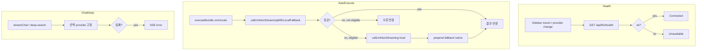

# LLM 헬스체크·폴백

## 개요

LLM 제공자 연결 상태는 `GET /api/llm/health`로 확인합니다. 기능별로 제공자 실패 시 폴백 동작이 다릅니다 — Auto만 OpenRouter → Local 자동 전환을 지원합니다.

## 목적

- UI에서 선택한 제공자의 가용성을 실시간 표시
- Auto 실행 시 클라우드 API 장애·쿼터 소진에 대한 복원력 제공
- Chat·Deep Research는 선택 제공자 고정으로 예측 가능한 동작 유지

## 주요 구성요소

| 구성요소 | 역할 | 관련 경로 |
|---------|------|----------|
| GET /api/llm/health | 헬스 API | `src/routes/api/llm/health/+server.ts` |
| checkLlmHealth | 제공자별 ping | `src/lib/server/llm/index.ts` |
| llmStore.refreshHealth | 클라이언트 폴링 | `src/lib/stores/llm.svelte.ts` |
| callLlmNonStreamingWithLocalFallback | Auto 폴백 | `src/lib/server/llm/index.ts` |
| Sidebar | 연결 상태 점·라벨 | `src/lib/components/Sidebar.svelte` |

## 헬스체크 API

### GET /api/llm/health

**쿼리**: `provider=local|omniroute` (미지정·알 수 없는 값 → `local`)

**동작**:

| provider | 확인 방법 | 타임아웃 |
|----------|----------|---------|
| `local` | `GET {OLLAMA_URL}/api/tags` | 5초 |
| `omniroute` | `GET {OMNIROUTE_BASE_URL}/models` (Bearer) | 5초 |

**응답 (JSON)**:

```json
{
  "ok": true,
  "provider": "local",
  "model": "llama3.1:8b"
}
```

- `ok`: 연결 성공 여부
- `model`: `getLlmModelLabel(provider)` 표시용 라벨

### 클라이언트 UI

- `Sidebar` 마운트 시 + 제공자 변경 시 `llmStore.refreshHealth()` 호출
- 상태 점: 녹색(Connected) / 빨간색(Unavailable) / 회색(checking…)
- `ChatInput` 푸터: `Powered by {label} · {model}`

## 기능별 폴백 동작

| 기능 | 제공자 소스 | Local 폴백 | 실패 시 |
|------|------------|-----------|---------|
| **Chat** | `llmStore.provider` | **없음** | SSE `{ type: 'error', message }` |
| **Deep Research** | `llmStore.provider` | **없음** | SSE `error` 이벤트 |
| **Auto** | 번들 `llmProvider` / `LLM_DEFAULT_PROVIDER` | **있음** | Local 재시도 + 안내 문구 prepend |

### Auto 폴백 (`callLlmNonStreamingWithLocalFallback`)

**조건**: primary가 `omniroute`이고 다음 중 하나:

- 빈 응답
- `isLlmFallbackEligibleError`에 해당하는 오류

**폴백 대상 오류**:

- 타임아웃 (`ECONNABORTED`, timed out)
- 네트워크: `ECONNREFUSED`, `ENOTFOUND`, `ETIMEDOUT`, `ERR_NETWORK`
- HTTP: 401, 402, 403, 429, 500, 502, 503
- 메시지 패턴: quota, credit, token, rate-limit, billing, unauthorized 등

**성공 시**: 응답 앞에 `buildLlmFallbackNotice('omniroute')` 추가

```
[OpenRouter 실패 → Local 모델로 응답]

{본문}
```

`BundleEditor`는 `omniroute` 선택 시 "OpenRouter 연결 실패 또는 토큰 소진 시 Local 모델로 자동 전환" 안내를 표시합니다.

### 연결 오류 메시지 (`getLlmConnectionErrorMessage`)

| provider | 메시지 (요약) |
|----------|--------------|
| `omniroute` | API 키·네트워크 확인 |
| `local` | `ollama serve` 실행, `llama3.1:8b` pull 확인 |

## 동작 흐름



## 사용 방법

### 헬스체크 호출 예

```bash
curl "http://localhost:5173/api/llm/health?provider=local"
curl "http://localhost:5173/api/llm/health?provider=omniroute"
```

### 운영 체크리스트

- **Local**: `ollama serve` 실행, `OLLAMA_MODEL` pull 완료
- **OpenRouter**: `OMNIROUTE_API_KEY` 설정, `OMNIROUTE_BASE_URL` 확인
- **Auto 스케줄 기본 제공자**: `LLM_DEFAULT_PROVIDER` env

## 관련 파일

- `src/routes/api/llm/health/+server.ts`
- `src/lib/server/llm/index.ts` — `checkLlmHealth`, `callLlmNonStreamingWithLocalFallback`
- `src/lib/server/llm/types.ts` — `getLlmConnectionErrorMessage`, `buildLlmFallbackNotice`
- `src/lib/stores/llm.svelte.ts`
- `src/lib/components/Sidebar.svelte`
- `src/lib/server/scheduler.ts` — Auto에서 폴백 함수 호출
- `src/routes/api/chat/+server.ts` — 폴백 없음
- `src/routes/api/deep-search/+server.ts` — 폴백 없음

## 참고

- Chat 스트리밍(`createLlmStream`)에는 타임아웃 재시도가 없고, 비스트리밍만 1회 재시도합니다.
- Deep Research 내부 합성 실패 시 outline → single-pass 등 **파이프라인 내부** 폴백은 있으나, 제공자 전환 폴백은 없습니다.
