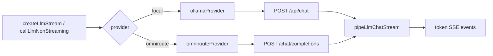

# LLM 제공자

## 개요

JukimBot은 두 가지 LLM 제공자를 지원합니다: **local**(Ollama)과 **omniroute**(OpenAI 호환 API, UI에서는 OpenRouter). `$lib/server/llm/` 모듈이 HTTP 호출·스트림 파싱·헬스체크를 통합합니다.

## 목적

- 로컬 Ollama와 클라우드 OpenRouter를 동일 인터페이스로 사용
- 스트리밍·비스트리밍·합성(stream kind)별 토큰 한도 분리
- Chat·Auto·Deep Research에서 제공자를 일관되게 라우팅

## 주요 구성요소

| 구성요소 | 역할 | 관련 경로 |
|---------|------|----------|
| llm/index.ts | Facade: createLlmStream, callLlmNonStreaming, 폴백 | `src/lib/server/llm/index.ts` |
| ollamaProvider.ts | Ollama HTTP (`/api/chat`) | `src/lib/server/llm/ollamaProvider.ts` |
| omnirouteProvider.ts | OpenAI 호환 HTTP (`/chat/completions`) | `src/lib/server/llm/omnirouteProvider.ts` |
| streamParsers.ts | NDJSON(Ollama) / SSE(OpenAI) → token 이벤트 | `src/lib/server/llm/streamParsers.ts` |
| types.ts | LlmProvider, env resolve, 라벨 | `src/lib/server/llm/types.ts` |
| llmStore | 클라이언트 제공자 선택·저장 | `src/lib/stores/llm.svelte.ts` |
| ollama.ts | llm/ 재export shim (deprecated) | `src/lib/server/ollama.ts` |

## 제공자 비교

| 항목 | local | omniroute |
|------|-------|-----------|
| UI 라벨 | Local | OpenRouter |
| 기본 URL | `http://localhost:11434` | `http://localhost:20128/v1` (env 미설정 시) |
| 스트림 API | `POST /api/chat` | `POST /chat/completions` |
| 기본 모델 (런타임) | `llama3.1:8b` | `auto` |
| 표시 모델 라벨 | `OLLAMA_MODEL` 또는 `llama3.1:8b` | `OMNIROUTE_MODEL` 또는 `openrouter/free` |
| 인증 | 없음 | `Bearer` (`OMNIROUTE_API_KEY` 또는 `LLM_API_KEY`) |
| 추가 헤더 | — | `HTTP-Referer`, `X-Title: JukimBot` |
| 헬스체크 | `GET /api/tags` | `GET /models` |

> `.env.example`의 `OMNIROUTE_BASE_URL`은 `https://openrouter.ai/api/v1`입니다. env를 설정하면 해당 URL이 사용됩니다.

## 환경 변수

| 변수 | 설명 | 기본값 (코드) |
|------|------|--------------|
| `OLLAMA_URL` | Ollama API 주소 | `http://localhost:11434` |
| `OLLAMA_MODEL` | 로컬 모델 | `llama3.1:8b` |
| `OLLAMA_NUM_PREDICT_STREAM` | chat 스트림 max tokens | `4096` |
| `OLLAMA_NUM_PREDICT_SYNTH` | synthesis/section max tokens | `8192` |
| `OLLAMA_NUM_PREDICT_NONSTREAM` | 비스트리밍 max tokens | `4096` (env), 코드 fallback `2048` |
| `OLLAMA_STREAM_TIMEOUT_MS` | 스트림 타임아웃 | `1_800_000` ms |
| `OLLAMA_NON_STREAM_TIMEOUT_MS` | 비스트리밍 타임아웃 | `1_800_000` ms |
| `OMNIROUTE_BASE_URL` | OpenRouter API | `http://localhost:20128/v1` |
| `OMNIROUTE_MODEL` | 모델 ID | `auto` |
| `OMNIROUTE_API_KEY` | API 키 | — |
| `LLM_API_KEY` | 대체 API 키 | `OMNIROUTE_API_KEY` 없을 때 |
| `LLM_DEFAULT_PROVIDER` | 서버 기본 제공자 (Auto) | `local` (env `omniroute`면 omniroute) |

## 스트림 종류 (LlmStreamKind)

| kind | 용도 | 기본 num_predict / max_tokens |
|------|------|------------------------------|
| `chat` | 일반 채팅 스트림 | `OLLAMA_NUM_PREDICT_STREAM` (4096) |
| `synthesis` | Deep Research 합성 | `OLLAMA_NUM_PREDICT_SYNTH` (8192) |
| `section` | 멀티섹션 합성 | `OLLAMA_NUM_PREDICT_SYNTH` (8192) |

## 동작 흐름

## 사용 방법

### Chat (클라이언트)

- 사이드바 **Model** 라디오: Local / OpenRouter
- `llmStore.setProvider()` → `localStorage` `jukimbot-llm-provider`
- `streamChat` / `streamDeepSearch` 요청 body에 `llmProvider` 포함

### Auto (번들별)

- `BundleEditor`에서 번들마다 제공자 선택
- `llmProvider` 필드가 IndexedDB `jukimbot-auto-bundles`에 저장
- 스케줄·Run Now 시 서버로 전달
- 미지정 시 `resolveDefaultLlmProvider()` (`LLM_DEFAULT_PROVIDER` env)

### API Facade 함수

| 함수 | 모드 | 설명 |
|------|------|------|
| `createLlmStream` | 스트리밍 | Chat·Deep 합성 |
| `callLlmNonStreaming` | 비스트리밍 | Deep 파이프라인 중간 단계 |
| `callLlmNonStreamingWithLocalFallback` | 비스트리밍 + 폴백 | Auto 전용 |
| `pipeLlmChatStream` | 파서 | upstream → `{ type: 'token' }` |
| `checkLlmHealth` | 헬스 | `/api/llm/health`에서 사용 |

비스트리밍은 타임아웃 시 1회 재시도 (`isLlmTimeoutError`).

## 관련 파일

- `src/lib/server/llm/index.ts`
- `src/lib/server/llm/ollamaProvider.ts`
- `src/lib/server/llm/omnirouteProvider.ts`
- `src/lib/server/llm/streamParsers.ts`
- `src/lib/server/llm/types.ts`
- `src/lib/stores/llm.svelte.ts`
- `src/lib/components/Sidebar.svelte`
- `src/lib/components/auto/BundleEditor.svelte`
- `.env.example`

## 참고

- `getLlmModelLabel('omniroute')`는 UI용 `openrouter/free`를 반환할 수 있으나, `omnirouteModel()` 런타임 기본값은 `auto`입니다.
- 클라이언트 `llmStore` 기본값은 `local`이며 `LLM_DEFAULT_PROVIDER` env를 읽지 않습니다.
- `ollama.ts`는 deprecated shim이며 신규 코드는 `$lib/server/llm`을 직접 import합니다.
