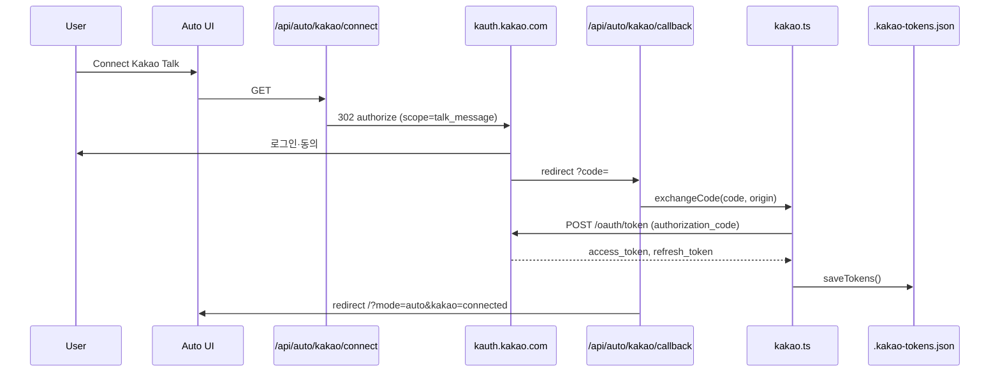

# 카카오 OAuth·메시지 전송

## 개요

Auto 모드는 카카오 로그인(OAuth 2.0)으로 사용자 토큰을 발급받고, 카카오톡 나에게 보내기 API(`talk/memo/default/send`)로 분석 결과를 전송합니다. 토큰은 서버 파일 `.kakao-tokens.json`에 저장됩니다.

## 목적

- 사용자 본인 카카오톡으로 Auto 분석 결과 자동 알림
- OAuth로 `talk_message` 스코프 획득 후 서버에서 메모 전송
- 긴 결과 텍스트를 청크 단위로 분할 전송

## 주요 구성요소

| 구성요소 | 역할 | 관련 경로 |
|---------|------|----------|
| `getAuthUrl` | OAuth 인가 URL 생성 | `src/lib/server/kakao.ts` |
| `exchangeCode` | 인가 코드 → 토큰 교환 | `src/lib/server/kakao.ts` |
| `refreshAccessToken` | 만료 시 토큰 갱신 | `src/lib/server/kakao.ts` |
| `sendMessageChunked` | 청크 분할·전송 | `src/lib/server/kakao.ts` |
| `GET /api/auto/kakao/connect` | OAuth 시작 (302 리다이렉트) | `src/routes/api/auto/kakao/connect/+server.ts` |
| `GET /api/auto/kakao/callback` | OAuth 콜백 처리 | `src/routes/api/auto/kakao/callback/+server.ts` |
| `GET /api/auto/kakao/status` | 연동 상태 | `src/routes/api/auto/kakao/status/+server.ts` |
| `POST /api/auto/kakao/test` | 테스트 메모 전송 | `src/routes/api/auto/kakao/test/+server.ts` |
| `autoStore.checkKakaoStatus` | UI 상태 폴링 | `src/lib/stores/auto.svelte.ts` |
| `scheduler.executeBundle` | 실행 후 카카오 자동 전송 | `src/lib/server/scheduler.ts` |

## OAuth 흐름

### OAuth URL 파라미터

| 파라미터 | 값 |
|---------|-----|
| `client_id` | `KAKAO_REST_API_KEY` (환경 변수) |
| `redirect_uri` | `{origin}/api/auto/kakao/callback` |
| `response_type` | `code` |
| `scope` | `talk_message` |

### 콜백 처리

- 성공: `/?mode=auto&kakao=connected`
- 실패: `/?mode=auto&kakao=error&msg={encodeURIComponent(error)}`
- OAuth `error` 쿼리 또는 `code` 누락 시 에러 리다이렉트

## 토큰 관리

| 함수 | 동작 |
|------|------|
| `isConfigured()` | `KAKAO_REST_API_KEY` 존재 |
| `isConnected()` | 토큰 파일 존재 + (미만료 또는 refresh_token 보유) |
| `ensureValidToken()` | 만료 시 `refreshAccessToken()` 후 access_token 반환 |
| `refreshAccessToken()` | 실패 시 `clearTokens()` 및 `null` |

Refresh grant: `grant_type=refresh_token`, 동일 `client_id`·`refresh_token`.

## 메시지 전송

### API

- **엔드포인트**: `POST https://kapi.kakao.com/v2/api/talk/memo/default/send`
- **인증**: `Authorization: Bearer {access_token}`
- **본문**: `template_object` (URL-encoded JSON)

템플릿 `object_type: "text"`, 고정 링크(`developers.kakao.com`), `button_title: "Open"`.

### 청크 전송

| 상수 | 값 | 설명 |
|------|-----|------|
| `CHUNK_SIZE` | 1000 | 청크 최대 글자 수 |
| `SEND_DELAY_MS` | 500 | 청크 간 대기 |

분할 우선순위: `\n\n` → `\n` → `. ` → 공백 → 강제 절단.

다중 청크 시 제목에 `(1/N)` 형식 접두사 추가. 401 응답 시 토큰 refresh 후 해당 청크 재시도.

### Auto 실행 연동

`scheduler.ts`의 `executeBundle()`:

- LLM 결과 생성 후 `isKakaoConnected()`이면 **항상** 카카오 전송 시도 (번들별 on/off 플래그 없음)
- 미연동 시 경고 로그만 출력하고 실행은 `success: true`로 계속
- 응답에 `kakaoSent`, `kakaoError` 포함

## API 엔드포인트

| 경로 | 메서드 | 설명 |
|------|--------|------|
| `/api/auto/kakao/connect` | GET | OAuth 인가 페이지로 리다이렉트. 미설정 시 500 |
| `/api/auto/kakao/callback` | GET | 코드 교환 후 UI 리다이렉트 |
| `/api/auto/kakao/status` | GET | `getConnectionInfo()` JSON |
| `/api/auto/kakao/test` | POST | 테스트 메모 전송 (연동·설정 검증) |

### 테스트 메시지

`POST /api/auto/kakao/test`는 한국 시간 포함 고정 문구를 `sendMessage('Test', ...)`로 전송합니다. `configured`·`connected` 미충족 시 400과 `connectionInfo` 반환.

## 사용 방법

### 환경 설정 (`.env.example` 기준)

1. [카카오 개발자](https://developers.kakao.com) 앱 생성
2. "카카오톡 메시지" 활성화
3. Redirect URI: `http://localhost:5173/api/auto/kakao/callback` (배포 origin에 맞게 추가)
4. REST API 키를 `KAKAO_REST_API_KEY`에 설정

### UI 연동

- `autoStore.checkKakaoStatus()` — 페이지 로드 시 연결 상태
- Connect 버튼 — `/api/auto/kakao/connect`로 이동
- `+page.svelte` — `kakao=connected` / `kakao=error` 쿼리 처리

## 관련 파일

- `src/lib/server/kakao.ts` — OAuth·토큰·전송 핵심
- `src/routes/api/auto/kakao/` — connect, callback, status, test
- `src/lib/server/scheduler.ts` — 실행 파이프라인 내 카카오 호출
- `src/lib/stores/auto.svelte.ts` — UI 상태·테스트
- `.env.example` — 설정 가이드
- `.gitignore` — `.kakao-tokens.json`

## 참고

- 카카오 전송은 **서버 OAuth 토큰** 기반이며, 클라이언트 IndexedDB와 무관합니다.
- `talk_message` 스코프 없이 연동하면 메모 API가 실패할 수 있습니다.
- 토큰 파일은 `.gitignore` 대상이므로 배포 환경마다 OAuth 재연동이 필요할 수 있습니다.
