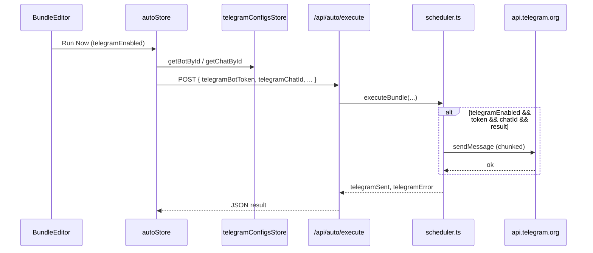

# 텔레그램 Bot API

## 개요

Auto 모드는 Telegram Bot API `sendMessage`로 분석 결과를 지정 채팅에 전송합니다. 봇 토큰·Chat ID는 클라이언트 IndexedDB에 저장하고, 실행 시 서버 API로 전달합니다. `.env`의 `TELEGRAM_BOT_TOKEN`은 연동 상태 표시용이며 실제 전송은 UI에 등록한 토큰을 우선합니다.

## 목적

- 번들별로 텔레그램 수신 채널·봇을 선택해 결과 알림
- Bot API 직접 호출로 별도 웹훅 서버 없이 단방향 메시지 전송
- 긴 LLM 출력을 4,000자 청크로 분할 전송

## 주요 구성요소

| 구성요소 | 역할 | 관련 경로 |
|---------|------|----------|
| `sendMessage` / `sendMessageChunked` | Bot API 호출·청크 전송 | `src/lib/server/telegram.ts` |
| `telegramConfigsStore` | 봇·채팅 목록 CRUD·IndexedDB 저장 | `src/lib/stores/telegramConfigs.svelte.ts` |
| `GET /api/auto/telegram/status` | `.env` 토큰 설정 여부 | `src/routes/api/auto/telegram/status/+server.ts` |
| `POST /api/auto/telegram/test` | 테스트 메시지 | `src/routes/api/auto/telegram/test/+server.ts` |
| `autoStore.executeBundle` | 봇/채팅 ID → 토큰·chatId resolve | `src/lib/stores/auto.svelte.ts` |
| `scheduler.executeBundle` | `telegramEnabled` 시 전송 | `src/lib/server/scheduler.ts` |
| `TelegramSettingsModal` | 봇·채팅 UI 설정 | `src/lib/components/auto/TelegramSettingsModal.svelte` |

## 데이터 모델

### IndexedDB 키

| 키 | 타입 | 필드 |
|----|------|------|
| `jukimbot-telegram-bots` | `TelegramBotConfig[]` | `id`, `name`, `botToken` |
| `jukimbot-telegram-chats` | `TelegramChatConfig[]` | `id`, `name`, `chatId` |

### AutoBundle 텔레그램 필드

| 필드 | 설명 |
|------|------|
| `telegramEnabled` | 전송 활성화 |
| `telegramBotId` | `TelegramBotConfig.id` 참조 |
| `telegramChatId` | `TelegramChatConfig.id` 참조 (chatId 문자열이 아님) |

실행 시 `telegramConfigsStore.getBotById` / `getChatById`로 실제 `botToken`·`chatId` 문자열을 resolve해 API 본문에 넣습니다.

## Bot API 호출

### 엔드포인트

```
POST https://api.telegram.org/bot{token}/sendMessage
```

### 요청 파라미터 (`URLSearchParams`)

| 파라미터 | 값 |
|---------|-----|
| `chat_id` | 수신 채팅 ID (문자열) |
| `text` | 메시지 본문 (`[제목]\n본문` 형식) |
| `disable_web_page_preview` | `true` |

### 타임아웃·에러

- `REQUEST_TIMEOUT_MS`: 25초 (`AbortController`)
- 실패 시 Telegram JSON의 `description` 필드를 에러 메시지로 반환

## 청크 전송

| 상수 | 값 |
|------|-----|
| `CHUNK_SIZE` | 4000 |
| `SEND_DELAY_MS` | 300 |

분할: `\n\n` 또는 `\n` (절반 이상 위치) 우선, 없으면 `maxLen`에서 절단. 다중 청크 시 `[제목] (i/N)` 접두사.

`sendMessage(title, text)` → 내부적으로 `sendMessageChunked` with `alreadyFormatted=true`.

## 동작 흐름



### 스케줄 실행

`POST /api/auto/schedule` `action: start` 시에도 동일하게 `telegramBotToken`·`telegramChatId`(실제 chat_id 문자열)를 서버 `ScheduledTask`에 저장합니다. 스케줄러가 주기 실행 시 같은 전송 조건을 적용합니다.

### 전송 조건 (`scheduler.ts`)

```
telegramEnabled && telegramBotToken && telegramChatId && researchResultText
```

토큰 또는 chatId 누락 시 경고 로그, `telegramSent: false`.

카카오와 달리 **번들별 `telegramEnabled` 플래그**로 on/off 합니다.

## API 엔드포인트

| 경로 | 메서드 | 요청 | 응답 |
|------|--------|------|------|
| `/api/auto/telegram/status` | GET | — | `{ configured: boolean }` — `.env` `TELEGRAM_BOT_TOKEN` 존재 |
| `/api/auto/telegram/test` | POST | `{ chatId, botToken? }` | `{ success }` 또는 `{ success: false, error }` |

테스트 API는 `botToken`이 비어 있으면 `resolveToken(undefined)` → 빈 문자열 → 전송 실패. UI 테스트는 항상 선택한 봇 토큰을 본문에 포함합니다.

## 사용 방법

### 봇·Chat ID 준비

1. [@BotFather](https://t.me/BotFather)에서 봇 생성 → 토큰 발급
2. 대상 채팅에 봇 초대 (그룹/채널) 또는 개인 DM
3. Chat ID 확인 (예: [@userinfobot](https://t.me/userinfobot) 등)

### UI 설정

1. Auto → Telegram 설정 모달에서 봇·수신처 등록 (`telegramConfigsStore`)
2. 번들 편집기에서 `telegramEnabled` 체크 후 봇·채팅 선택
3. "Test Telegram" → `POST /api/auto/telegram/test`

### 환경 변수 (선택)

`.env`의 `TELEGRAM_BOT_TOKEN`은 `/api/auto/telegram/status`의 `configured`만 영향. `.env.example` 주석: 실제 전송은 UI 설정 사용.

## 관련 파일

- `src/lib/server/telegram.ts` — Bot API 클라이언트
- `src/lib/stores/telegramConfigs.svelte.ts` — 봇·채팅 저장
- `src/lib/types/auto.ts` — `TelegramBotConfig`, `TelegramChatConfig`, `AutoBundle`
- `src/routes/api/auto/telegram/` — status, test
- `src/routes/api/auto/execute/+server.ts` — Run Now 시 토큰·chatId 수신
- `src/routes/api/auto/schedule/+server.ts` — 스케줄 등록 시 토큰·chatId 수신
- `src/lib/server/scheduler.ts` — 전송 오케스트레이션
- `src/lib/components/auto/TelegramSettingsModal.svelte` — 설정 UI

## 참고

- 텔레그램은 **인바운드 웹훅을 사용하지 않습니다**. 서버→Telegram 단방향 `sendMessage`만 구현되어 있습니다.
- 봇 토큰은 클라이언트 IndexedDB에 평문 저장됩니다. 공유 PC 사용 시 주의하세요.
- `autoStore.executeBundle`은 텔레그램 미설정 시 `console.warn`만 출력하고 API 호출은 계속합니다 (서버에서 전송 스킵).
