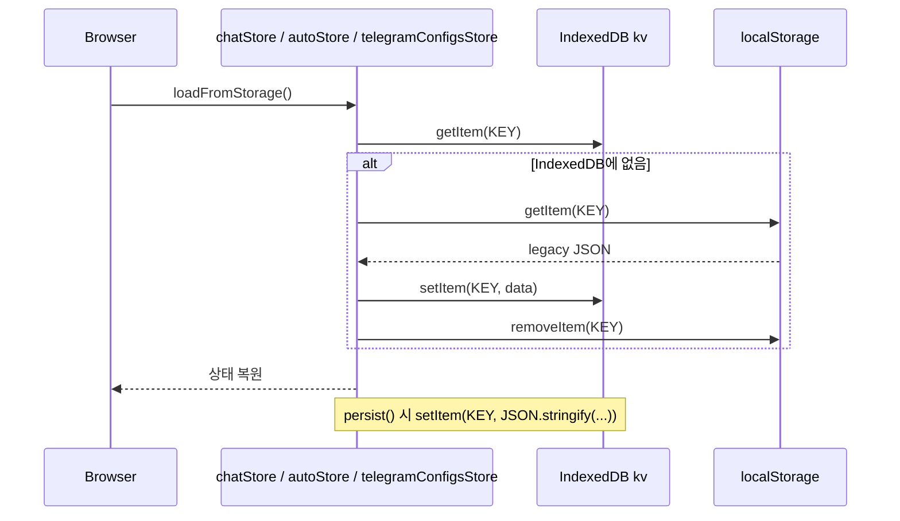

# IndexedDB 키·마이그레이션

## 개요

JukimBot은 브라우저 클라이언트 데이터를 IndexedDB 단일 KV 스토어에 저장합니다. Chat·Auto·Telegram 설정은 `localStorage`에서 IndexedDB로 이전하는 런타임 마이그레이션을 수행합니다.

## 목적

- 대용량 대화·번들 데이터를 `localStorage` 한도(약 5MB)보다 넉넉한 IndexedDB에 보관
- 단일 KV 스토어로 키-값 CRUD를 단순화
- 기존 `localStorage` 사용자 데이터를 자동 이전해 업그레이드 시 데이터 손실 방지

## 주요 구성요소

| 구성요소 | 역할 | 관련 경로 |
|---------|------|----------|
| `DB_NAME` / `DB_VERSION` / `STORE_NAME` | DB·버전·오브젝트 스토어 상수 | `src/lib/db/constants.ts` |
| `openDb()` | DB 연결·`onupgradeneeded`에서 스토어 생성 | `src/lib/db/openDb.ts` |
| `getItem` / `setItem` / `removeItem` | KV CRUD (값은 문자열) | `src/lib/db/indexedDb.ts` |
| `chatStore` | 대화 목록 저장·로드 | `src/lib/stores/chat.svelte.ts` |
| `autoStore` | Auto 번들 저장·로드 | `src/lib/stores/auto.svelte.ts` |
| `telegramConfigsStore` | 텔레그램 봇·채팅 설정 | `src/lib/stores/telegramConfigs.svelte.ts` |

## 데이터베이스 스키마

| 항목 | 값 |
|------|-----|
| 데이터베이스 이름 | `jukimbot-db` |
| 버전 | `1` |
| 오브젝트 스토어 | `kv` (키 경로 인덱스, `put(value, key)` 패턴) |
| 값 타입 | 문자열 (`JSON.stringify` 결과를 저장) |

`openDb()`의 `onupgradeneeded`는 `kv` 스토어가 없을 때만 `createObjectStore('kv')`를 호출합니다. 버전 1 이상으로 올릴 때 추가 마이그레이션 로직은 아직 없습니다.

## 저장 키 목록

| 키 | 저장 주체 | 값 형식 | 설명 |
|----|----------|---------|------|
| `jukimbot-chat-conversations` | `chatStore` | `Conversation[]` JSON | 채팅 대화·메시지 |
| `jukimbot-auto-bundles` | `autoStore` | `AutoBundle[]` JSON | Auto 번들·스케줄·실행 이력 |
| `jukimbot-telegram-bots` | `telegramConfigsStore` | `TelegramBotConfig[]` JSON | 텔레그램 봇 이름·토큰 |
| `jukimbot-telegram-chats` | `telegramConfigsStore` | `TelegramChatConfig[]` JSON | 텔레그램 수신처 이름·chatId |

### localStorage 전용 (IndexedDB 미사용)

| 키 | 저장 주체 | 설명 |
|----|----------|------|
| `jukimbot-llm-provider` | `llmStore` | 선택된 LLM 제공자 (`local` / `omniroute`) |

## 마이그레이션 동작

### Chat·Auto: localStorage → IndexedDB

`loadFromStorage()` 공통 패턴:

1. IndexedDB에서 키 조회
2. 값이 없으면 `localStorage.getItem(같은 키)` 시도
3. `localStorage`에 데이터가 있으면 IndexedDB에 `setItem` 후 `localStorage.removeItem`
4. JSON 파싱 후 스토어 상태 복원

Chat은 `createdAt`·`updatedAt`·`timestamp`를 `Date`로 변환하고 `isStreaming: false`로 정규화합니다. Auto는 `scheduleType`·`telegramEnabled` 등 필드 기본값을 보정합니다.

### Telegram: localStorage + 레거시 키 통합

`telegramConfigsStore.loadFromStorage()`:

1. IndexedDB에서 `jukimbot-telegram-bots`·`jukimbot-telegram-chats` 조회
2. 둘 다 없으면 `localStorage`에서 동일 키 + 레거시 `jukimbot-telegram-configs` 조회
3. IndexedDB로 복사 후 `localStorage` 키 삭제
4. 레거시 `jukimbot-telegram-configs`가 있으면 단일 배열에서 봇·채팅 항목을 분리해 새 구조로 변환 후 `removeItem(OLD_CONFIGS_KEY)`

레거시 항목 형식: `{ name, botToken?, chatId? }[]`

## 동작 흐름

## 사용 방법

### 개발자: 새 클라이언트 데이터 추가

1. `src/lib/db`의 `getItem` / `setItem` 사용
2. 키는 `jukimbot-{도메인}-{엔티티}` kebab-case 권장
3. `browser` 가드 후 `loadFromStorage` / `persist` 패턴 따르기
4. 스키마 변경 시 `DB_VERSION` 증가 + `onupgradeneeded`에 변환 로직 추가

### DB 버전 업그레이드 (미구현 시 참고)

현재 `DB_VERSION = 1`이며 스토어 생성만 수행합니다. 키 구조 변경이나 스토어 분리가 필요하면 `constants.ts`의 버전을 올리고 `openDb.ts`의 `onupgradeneeded`에서 이전 버전별 분기를 구현해야 합니다.

## 관련 파일

- `src/lib/db/constants.ts` — DB 이름·버전·스토어명
- `src/lib/db/openDb.ts` — 연결·업그레이드 훅
- `src/lib/db/indexedDb.ts` — KV API
- `src/lib/db/index.ts` — re-export
- `src/lib/stores/chat.svelte.ts` — `jukimbot-chat-conversations`
- `src/lib/stores/auto.svelte.ts` — `jukimbot-auto-bundles`
- `src/lib/stores/telegramConfigs.svelte.ts` — 텔레그램 키·레거시 마이그레이션
- `src/lib/stores/llm.svelte.ts` — localStorage 전용 LLM 제공자

## 참고

- IndexedDB는 브라우저별 origin에 격리됩니다. 서버 사이드에서는 접근할 수 없습니다.
- `persist()` 실패(quota exceeded 등)는 `.catch(() => {})`로 무시됩니다.
- 텔레그램 봇 토큰은 IndexedDB(클라이언트)에 저장되므로 민감 정보 취급에 유의하세요.
