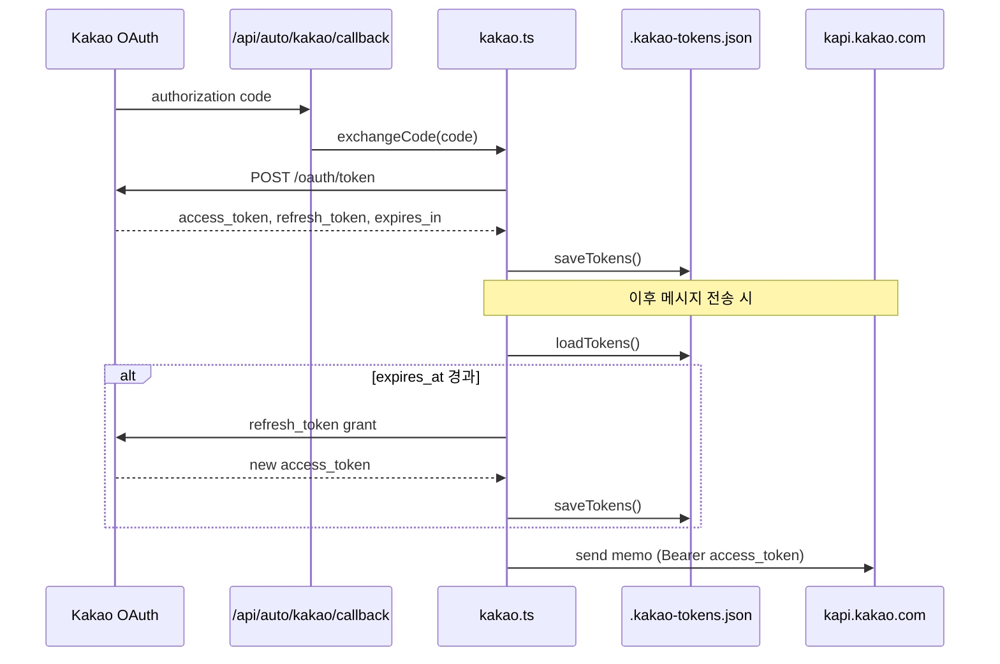

# 서버 파일 저장

## 개요

서버(Node.js) 측 영구 저장은 파일 시스템을 사용합니다. 현재 구현된 서버 파일 저장은 카카오 OAuth 토큰(`.kakao-tokens.json`)뿐이며, Auto 번들·채팅 데이터는 클라이언트 IndexedDB에만 존재합니다.

## 목적

- 카카오 OAuth access/refresh 토큰을 서버 프로세스 재시작 후에도 유지
- OAuth 연동 상태를 파일 기반으로 관리해 별도 DB 없이 운영

## 주요 구성요소

| 구성요소 | 역할 | 관련 경로 |
|---------|------|----------|
| `TOKEN_FILE` | 토큰 파일 경로 (프로젝트 루트) | `src/lib/server/kakao.ts` |
| `loadTokens` / `saveTokens` / `clearTokens` | 읽기·쓰기·삭제 | `src/lib/server/kakao.ts` |
| `.gitignore` | 토큰 파일 커밋 제외 | `.gitignore` |

## 파일 상세

### `.kakao-tokens.json`

| 항목 | 값 |
|------|-----|
| 경로 | 프로젝트 루트 (`path.resolve('.kakao-tokens.json')`) |
| 형식 | JSON |
| Git 추적 | 제외 (`.gitignore`) |

**저장 필드 (`KakaoTokens` 인터페이스)**

| 필드 | 타입 | 설명 |
|------|------|------|
| `access_token` | string | 카카오 API 호출용 액세스 토큰 |
| `refresh_token` | string | 액세스 토큰 갱신용 |
| `expires_at` | number | 만료 시각 (Unix ms, `Date.now() + expires_in * 1000`) |

### 읽기·쓰기 규칙

- **로드**: 파일 없음·파싱 실패·필수 필드 누락 시 `null` 반환
- **저장**: `JSON.stringify(tokens, null, 2)`로 포맷팅 후 `writeFileSync`
- **삭제**: refresh 실패 시 `clearTokens()`로 파일 삭제 → 재연동 필요

## 동작 흐름

## 사용 방법

### 최초 연동

1. `.env`에 `KAKAO_REST_API_KEY` 설정 (`.env.example` 참고)
2. 카카오 개발자 콘솔에 Redirect URI 등록: `{origin}/api/auto/kakao/callback`
3. UI에서 "Connect Kakao Talk" → `GET /api/auto/kakao/connect` → OAuth 완료 후 콜백에서 토큰 파일 생성

### 연동 상태 확인

`GET /api/auto/kakao/status` 응답:

| 필드 | 설명 |
|------|------|
| `configured` | `KAKAO_REST_API_KEY` 존재 여부 |
| `connected` | 토큰 존재 및 (만료 시 refresh_token 보유) |
| `hasTokens` | 파일에 토큰 레코드 존재 |
| `tokenExpired` | `expires_at` 경과 여부 |
| `expiresAt` | 만료 시각 ISO 문자열 |

### 토큰 초기화

파일을 수동 삭제하거나 refresh 실패 시 서버가 `clearTokens()`를 호출합니다. 이후 UI에서 카카오 재연동이 필요합니다.

## 관련 파일

- `src/lib/server/kakao.ts` — 토큰 파일 I/O·OAuth·메시지 전송
- `src/routes/api/auto/kakao/callback/+server.ts` — OAuth 콜백 → `exchangeCode`
- `src/routes/api/auto/kakao/status/+server.ts` — 연결 상태 API
- `.env.example` — `KAKAO_REST_API_KEY` 설정 안내
- `.gitignore` — `.kakao-tokens.json` 제외

## 참고

- 텔레그램 봇 토큰은 서버 파일이 아닌 **클라이언트 IndexedDB**(`jukimbot-telegram-bots`) 또는 요청 본문으로 전달됩니다. `.env`의 `TELEGRAM_BOT_TOKEN`은 `/api/auto/telegram/status`의 `configured` 표시용이며 실제 전송은 UI 설정 토큰을 우선합니다.
- 서버 스케줄러는 메모리 내 `ScheduledTask` 맵만 사용하며 디스크에 스케줄을 저장하지 않습니다. 재시작 영향·복원 방안은 [auto/scheduler-persistence.md](../auto/scheduler-persistence.md)를 참고하세요.
